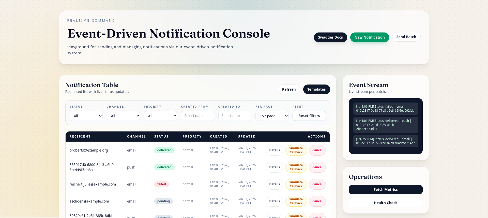

# **Event-Driven Notification System**

<p align="center">



</p>

<p align="center"><b>
Playground Web UI
</b></p>

## Overview

This repository implements a scalable, event-driven notification platform that processes and delivers messages across multiple channels (**SMS, Email, Push**) with:

* Asynchronous processing via **Redis queues**
* Per-channel **rate limiting**
* **Priority queues** (`high`, `normal`, `low`)
* Intelligent retries with **exponential backoff**
* Explicit **Accepted ≠ Delivered** status model
* **Pluggable provider adapters + capability interfaces (OOP)**
* **Provider webhooks (delivery receipts)**
* Automatic “unknown” marking for stale accepted messages (**TTL**)
* Real-time updates via **Laravel Reverb (WebSockets)**
* Secure, sandboxed **Blade template system**
* Full **Swagger/OpenAPI documentation**
* **Docker Compose** one-command setup
* Automated tests (**Pest**) + **GitHub Actions CI**
* A **Playground Web UI** for interactive demo and manual testing

This project was built to satisfy all core requirements of the Insider One assessment while implementing all major bonus features.

---

## Assessment Alignment

| Requirement             | Implementation                                                                     |
| ----------------------- | ---------------------------------------------------------------------------------- |
| Async processing        | Redis queues + dedicated workers                                                   |
| Rate limiting           | Configurable per channel                                                           |
| Priority queues         | Separate queues: `notifications-high`, `notifications-normal`, `notifications-low` |
| Batch creation          | Up to 1000 per request                                                             |
| Cancel pending          | Supported                                                                          |
| Filtering + pagination  | Supported                                                                          |
| Template system         | Blade (safe subset)                                                                |
| WebSockets              | Laravel Reverb                                                                     |
| Scheduled notifications | Supported                                                                          |
| Delivery & Retry        | Exponential backoff                                                                |
| Observability           | Metrics + health + structured logs                                                 |
| Distributed tracing     | Correlation IDs                                                                    |
| Docker Compose          | One-command setup                                                                  |
| Swagger/OpenAPI         | Included                                                                           |
| Tests                   | Runnable with one command                                                          |
| CI/CD                   | GitHub Actions included                                                            |

---

## High-Level Architecture

```none
[Playground UI / API Clients]
             │
             ▼
        [Laravel API]
             │
             ▼
        [MySQL + Redis]
             │
             ▼
        [Redis Queues]
      ┌──────────────────────┐
      │                      │
[notifications-high]   [notifications.status_sync]
[notifications-normal]
[notifications-low]
      │                      │
      ▼                      ▼
SendNotificationJob   SyncNotificationStatusJob
      │                      │
      ▼                      │
[Provider Adapter] ◀─────────┘ (polling, if supported)
      │
      ▼
[Provider Webhook (Delivery Receipt)]
      │
      ▼
[Reverb WebSocket Broadcast]
```

---

## Status Lifecycle (Accepted ≠ Delivered)

We explicitly model the distinction between provider acceptance and final delivery.

Typical lifecycle:

```none
pending → queued → sending → accepted → (delivered | failed)
```

Special cases:

* `scheduled` → later enters queue
* `accepted` older than TTL (default 24h) → `unknown`

> **accepted** = provider received the request (e.g., HTTP 202)
> **delivered/failed** = confirmed via provider callback (delivery receipt)

---

## Provider Architecture (Adapter + Capability Pattern)

Providers are pluggable and selected per channel via a registry.

Core interfaces:

```php
interface NotificationProviderInterface {
    public function send(SendRequest $request): SendResult;
    public function name(): string;
}

interface DeliveryReceiptHandlerInterface {
    public function verify(array $headers, string $rawBody): void;
    public function parse(string $rawBody): DeliveryReceiptDTO;
}

interface StatusQueryableProviderInterface {
    public function fetchStatus(string $providerMessageId): ProviderStatusDTO;
}
```

### Default Provider: `WebhookSiteProvider`

Included for assessment simulation. It implements:

* `NotificationProviderInterface`
* `DeliveryReceiptHandlerInterface`

> **Note:** It does *not* implement `StatusQueryableProviderInterface`, so reconciliation polling only applies if a provider with that capability is added.

---

## Delivery Receipts (Provider Callbacks)

Endpoint:

```none
POST /api/providers/{provider}/callbacks
```

Example payload (simulated):

```json
{
  "message_id": "provider-message-id-here",
  "status": "delivered",
  "timestamp": "2026-02-03T10:00:00Z"
}
```

Or failure:

```json
{
  "message_id": "provider-message-id-here",
  "status": "failed",
  "timestamp": "2026-02-03T10:00:00Z",
  "error": {
    "code": "DELIVERY_FAILED",
    "message": "Simulated failure"
  }
}
```

Features:

* Optional provider signature verification
* Idempotent processing
* Immediate WebSocket broadcast on status change

> The **Playground UI** includes a **“Simulate Callback”** button that triggers this endpoint automatically.

---

## Automatic Reconciliation (Self-Healing)

If a notification is `accepted` but **no receipt arrives within 5 minutes**, and the provider supports polling:

* System calls `fetchStatus(providerMessageId)`
* Backoff: `5m → 15m → 60m → 6h`
* After **24 hours** → status becomes `unknown`

This runs on a dedicated queue: **`notifications.status_sync`**

---

## Playground Web UI

The project includes a browser-based **Event-Driven Notification Console** where you can:

* View paginated notifications with live status updates via WebSocket integration
* Filter by status, channel, priority, and date range
* Create new notifications (single or batch)
* Use templates with variables
* Simulate provider callbacks
* Fetch metrics and run health checks
* Open Swagger documentation

**URL:** [http://localhost:8000/](http://localhost:8000/)

---

## Template System (Blade — Safe Subset)

Allowed:

* `@if`, `@elseif`, `@else`, `@endif`
* `@foreach`, `@endforeach`
* `@isset`, `@endisset`

Forbidden:

* `@php`
* `{!! !!}`
* `@include`, `@extends`, `@component`, `@inject`

Validate templates via:

```none
POST /api/templates/validate
```

---

## 📡 WebSockets (Laravel Reverb)

WebSocket server runs at:

```none
ws://localhost:8080
```

Clients subscribe to:

```none
private-batch.{batchId}
```

Event:

```none
notification.status.changed
```

---

## Observability

### Metrics

```none
GET /api/metrics
```

Example:

```json
{
  "queue_depth": 245,
  "success_last_minute": 1200,
  "failed_last_minute": 12,
  "avg_latency_ms": 230
}
```

### Health

```none
GET /health
```

---

## Local Setup (Docker — One Command)

### 1) Copy environment

```bash
cp .env.example .env
```

### 2) Start everything

```bash
docker compose up -d --build
```

Services started:

| Service          | Port                                           |
| ---------------- | ---------------------------------------------- |
| API + Playground | [http://localhost:8000](http://localhost:8000) |
| Reverb WS        | ws://localhost:8080                            |
| MySQL            | 3306                                           |
| Redis            | 6379                                           |

> The `app` container automatically runs migrations and seeders on startup.

---

## Swagger / OpenAPI

Visit:

```none
http://localhost:8000/api/documentation
```

---

## Run Tests

```bash
docker compose exec app php artisan test --compact
```

---

## Important ENV Variables

```env
WEBHOOK_SITE_URL=https://webhook.site/your-uuid
NOTIFICATIONS_RATE_LIMIT=100
NOTIFICATIONS_STATUS_SYNC_DELAYS=5,15,60,360
NOTIFICATIONS_STATUS_SYNC_TTL_HOURS=24

REVERB_HOST=reverb
REVERB_PORT=8080
QUEUE_CONNECTION=redis
```

---

## Example API Calls

### Create Single Notification

```bash
curl -X POST http://localhost:8000/api/notifications \
-H "Content-Type: application/json" \
-d '{
  "to": "+905551234567",
  "channel": "sms",
  "content": "Hello from Insider assessment!",
  "priority": "high"
}'
```

### Create Batch

```bash
curl -X POST http://localhost:8000/api/notifications/batch \
-H "Content-Type: application/json" \
-d '{
  "notifications": [
    {"to":"+905551234567","channel":"sms","content":"A"},
    {"to":"user@example.com","channel":"email","content":"B"}
  ]
}'
```

### Cancel

```none
POST /api/notifications/{id}/cancel
```

### List with Filters

```none
GET /api/notifications?status=failed&channel=sms&page=1
```

---none

## Idempotency

You may send:

```none
Idempotency-Key: your-key-here
```

to prevent duplicate notifications.

---

## CI/CD (GitHub Actions)

Pipeline runs:

* Composer install
* SQLite-based migration setup
* Pest tests
* Laravel Pint
* PHPStan (if configured)

---

## Why This Is Strong for Insider

* Realistic production design
* Clean OOP with provider adapters
* Explicit accepted vs delivered modeling
* Webhooks + reconciliation fallback
* Live WebSockets
* Safe templating
* Docker + Swagger + tests
* **Interactive Playground UI** for demonstration
